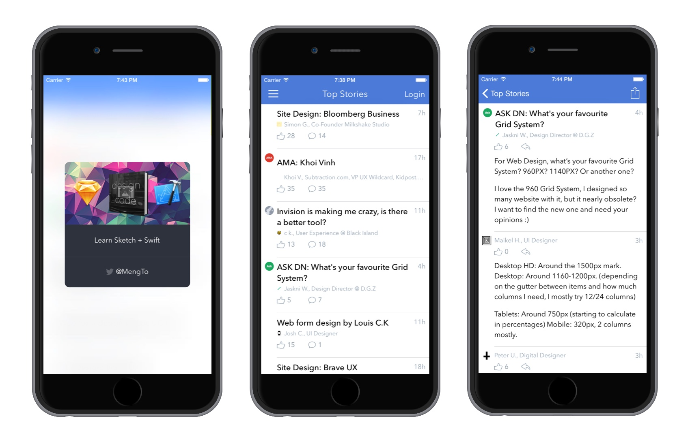

# Symphony iOS


(Forked from [DesignerNewsApp](https://github.com/MengTo/DesignerNewsApp.git), rewrote and reassigned api.)

Simple iOS client for [黑客派(HacPai.com)](http://hacpai.com), written in Swift.

## Usage

1) Download the repository

```
$ git clone https://github.com/b3log/symphony-ios.git
$ cd symphony-ios
```
    
2) Initialize submodule dependancies

```
$ git submodule update --init --recursive
```

3) Open the project in Xcode

```
$ open HPApp.xcodeproj
```

4) Compile and run the app in your simulator


# Requirements

- Xcode 6.3
- iOS 8

# Credits
- [DesignerNewsApp][] for app
- [Designer News][] for api cases
- [Alamofire][] for network request
- [DTCoreText][] for fast and efficient HTML content display
- [Spring][] for code-less animation

[DesignerNewsApp]:https://github.com/MengTo/DesignerNewsApp.git
[Alamofire]:https://github.com/Alamofire/Alamofire
[DTCoreText]:https://github.com/Cocoanetics/DTCoreText
[Design+Code]:http://designcode.io
[Designer News]:https://news.layervault.com
[Spring]:https://github.com/MengTo/Spring
